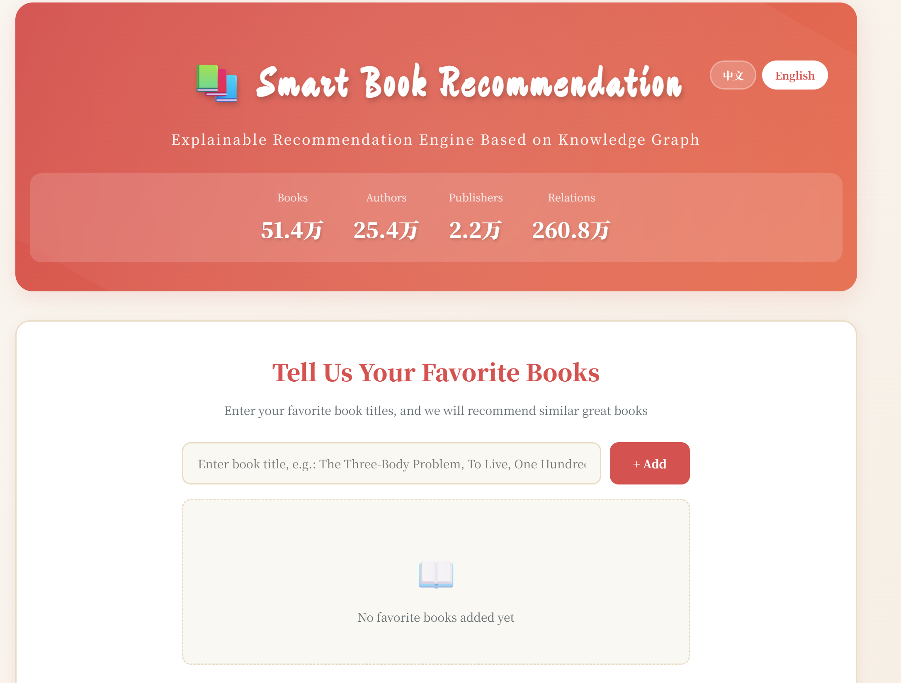
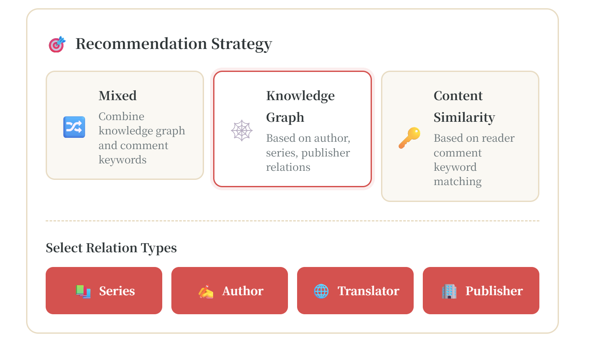
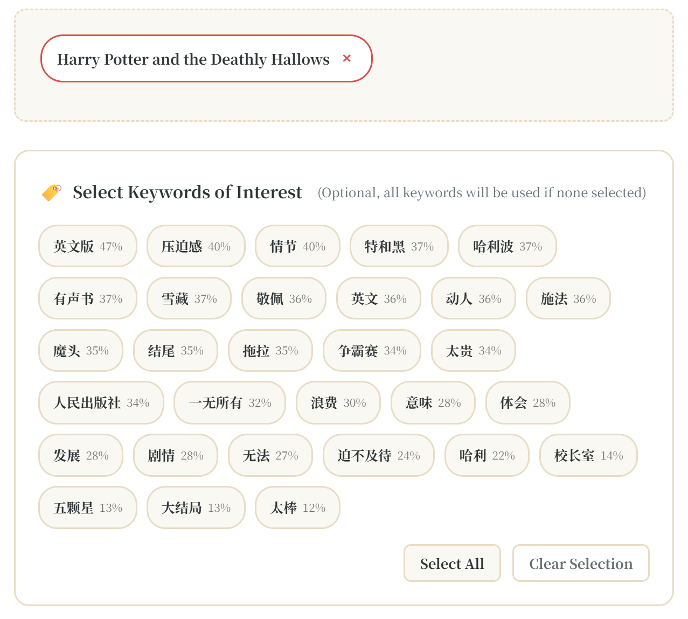

# 📚 Intelligent Book Recommendation System Based on Knowledge Graph

<div align="center">

[中文](README_CN.md) | **English**


An intelligent book recommendation system based on knowledge graphs and review keywords, providing explainable recommendations with multiple customizable strategies and bilingual (Chinese/English) interface support.

[Features](#-features) • [Demo](#-demo) • [Quick Start](#-quick-start) • [Usage Guide](#-usage-guide) • [Tech Stack](#-tech-stack)

</div>

---

## 📸 Screenshots

> **Note**: Please replace with actual screenshots after deployment
> 
> Recommended screenshots:
> 1. Main Interface - Search box and language switcher
> 2. Strategy Selection - Three recommendation strategies
> 3. Keyword Selection - Intelligently extracted keywords
> 4. Results - Recommendation list with detailed reasons
>
> Place screenshots in `screenshots/` folder and update links below

### Main Interface

*Modern gradient design with bilingual support*

### Strategy Selection

*Knowledge graph, keyword-based, and hybrid recommendation strategies*

### Keyword Selection

*Intelligently extracted book review keywords with user customization*

### Recommendation Results

*Detailed recommendation reasons and matching scores*

---

## ✨ Features

### 🎯 Intelligent Recommendation Algorithms
- **Knowledge Graph Recommendations**: Based on relationships between books (authors, publishers, translators, series)
- **Review Keyword Matching**: Dual algorithm (TF-IDF + TextRank) for extracting book features
- **Hybrid Strategy**: Combines advantages of both approaches for more accurate recommendations

### 🔧 Customizable Recommendation Strategies
- **Pure Knowledge Graph**: Choose single or multiple relationships (author, series, publisher, translator)
- **Pure Keyword-based**: Match based on user-selected book feature keywords
- **Hybrid Mode**: Intelligently fuses both strategies

### 🧠 Intelligent Keyword Recognition
- **Semantic Classification**: Automatically identifies 5 categories (theme, plot, character, style, worldview)
- **User Customization**: Users can select keywords they care about
- **High Quality Extraction**: 77 stopwords filtering ensures keyword quality

### 🚀 Performance Optimization
- **Multiprocessing Acceleration**: 5-8x speedup using parallel keyword extraction
- **Smart Caching**: First run caches results, subsequent startups take only 5-10 seconds
- **Incremental Updates**: Supports cache incremental updates and management

### 🌍 Internationalization Support
- **Bilingual Interface**: Complete Chinese/English support
- **Language Switching**: One-click language toggle with automatic preference saving
- **SEO Friendly**: Proper HTML lang attributes

### 💡 Explainability
- **Recommendation Reasons**: Clear explanations for each recommendation
- **Matching Scores**: Quantified recommendation confidence
- **Relationship Paths**: Shows connections between books

---

## 🎬 Demo

> **Online Access**: [https://your-app-url.com](https://your-app-url.com) *(Update after deployment)*

Local run:

```bash
python start.py
# Visit http://localhost:5000
```

See [DEPLOYMENT.md](DEPLOYMENT.md) for deployment guide

---

## 🚀 Quick Start

### Requirements

- Python 3.8+
- 4GB+ RAM (8GB recommended)
- Multi-core CPU (for parallel processing)

### Installation

1. **Clone the repository**

```bash
git clone https://github.com/yourusername/doubanBookComment.git
cd doubanBookComment
```

2. **Install dependencies**

```bash
pip install -r requirements.txt
```

3. **Prepare data**

Ensure the following data files exist:
- `newBookInformation`: Book information data
- `newCommentdata`: Review data
- `ChineseStopWords.txt`: Chinese stopwords list

4. **Build knowledge graph**

```bash
python knowledge_graph_builder.py
```

First run will:
- Load 680,000+ books
- Extract 3.67 million reviews
- Build knowledge graph relationships
- Extract review keywords (using multiprocessing)
- Save cache files to `knowledge_graph/` directory

⏱️ Estimated time: 30-60 minutes (depends on CPU cores)

5. **Start service**

```bash
python start.py
```

Service will start at `http://localhost:5000`

---

## 📖 Usage Guide

### Web Interface

#### 1. Add Favorite Books

- Enter book name in search box, system provides auto-complete suggestions
- Click "Add" button to add book to list
- Add multiple books for more accurate recommendations

#### 2. Choose Recommendation Strategy

**Knowledge Graph Recommendation**
- Select relationship types: author, series, publisher, translator
- Single or multiple selection
- Based on structured relationships between books

**Keyword-based Recommendation**
- System automatically extracts feature words from reviews
- Users can select keywords of interest
- Based on semantic similarity

**Hybrid Recommendation** (Recommended)
- Combines advantages of both approaches
- Provides more comprehensive results

#### 3. Customize Keywords (Optional)

- Click "Select Keywords" button
- System displays high-quality keywords extracted from reviews
- Select feature words you care about
- System will match based on these keywords

#### 4. View Results

Each recommendation includes:
- 📖 Book name and Douban link
- ⭐ Douban rating
- 📊 Matching score
- 💡 Detailed recommendation reasons

#### 5. Switch Language

- Click language switcher button in top-right corner
- Supports Chinese/English toggle
- Language preference automatically saved

### API Usage

#### Get Recommendations

```bash
POST /api/recommend
Content-Type: application/json

{
    "favorite_books": ["The Three-Body Problem", "To Live", "One Hundred Years of Solitude"],
    "strategy": "mixed",
    "relation_types": ["author", "series"],
    "selected_keywords": ["sci-fi", "humanity", "philosophy"],
    "top_k": 20,
    "lang": "en"
}
```

**Parameters**:
- `favorite_books`: List of user's favorite books (required)
- `strategy`: Recommendation strategy - `kg_only`, `keyword_only`, `mixed` (default: `mixed`)
- `relation_types`: Knowledge graph relationship types - `author`, `series`, `publisher`, `translator`
- `selected_keywords`: User-selected keyword list
- `top_k`: Number of recommendations to return (default: 20)
- `lang`: Language - `zh`, `en` (default: `zh`)

**Response Example**:

```json
{
    "success": true,
    "data": {
        "favorite_books": ["The Three-Body Problem"],
        "recommendations": [
            {
                "book_id": 12345,
                "book_name": "Ball Lightning",
                "book_url": "https://book.douban.com/subject/12345/",
                "rating": 8.5,
                "score": 0.92,
                "reasons": [
                    "Same author as 'The Three-Body Problem': Liu Cixin",
                    "Keyword match: sci-fi(0.85), physics(0.78)"
                ],
                "explanation": "This book has high similarity with your favorite 'The Three-Body Problem'..."
            }
        ],
        "total": 20,
        "strategy": "mixed"
    }
}
```

#### Search Books

```bash
GET /api/search?q=three+body&limit=10
```

#### Get Book Keywords

```bash
GET /api/book_keywords/12345?lang=en
```

#### Get System Stats

```bash
GET /api/stats?lang=en
```

---

## 🏗️ Tech Stack

### Backend

| Technology | Purpose |
|------------|---------|
| **Flask** | Web framework |
| **NetworkX** | Knowledge graph construction and querying |
| **Pandas** | Data processing |
| **NumPy** | Numerical computation |
| **Jieba** | Chinese word segmentation |
| **scikit-learn** | TF-IDF feature extraction |
| **Gensim** | TextRank keyword extraction |

### Frontend

| Technology | Purpose |
|------------|---------|
| **Vanilla JavaScript** | Frontend logic |
| **CSS3** | Modern styling |
| **LocalStorage** | User preference storage |

### Core Algorithms

#### 1. Knowledge Graph Construction

```
Book Entity ──written_by──> Author Entity
            ├─published_by──> Publisher Entity
            ├─translated_by──> Translator Entity
            └─belongs_to──> Series Entity
```

**Relationship Weights**:
- Same author: 0.30
- Same series: 0.40
- Same publisher: 0.15
- Same translator: 0.20

#### 2. Review Keyword Extraction

**Dual Algorithm Fusion**:
- **TF-IDF**: Statistical term frequency and inverse document frequency
- **TextRank**: Graph-based keyword extraction

**Semantic Classification**:
- Theme: sci-fi, history, romance, mystery...
- Plot: twist, pacing, foreshadowing, climax...
- Character: character, role, personality, growth...
- Style: humorous, profound, delicate, shocking...
- Worldview: worldview, setting, fictional, future...

**Quality Assurance**:
- 77 stopwords filtering
- Minimum word length limit
- Word frequency threshold filtering

#### 3. Recommendation Algorithm

**Hybrid Strategy**:

```python
score = α × kg_score + β × keyword_score

Where:
- kg_score: Knowledge graph relationship score
- keyword_score: Keyword similarity score
- α, β: Adjustable weights (default 0.5, 0.5)
```

---

## 📁 Project Structure

```
doubanBookComment/
├── app.py                      # Flask main application
├── start.py                    # Startup script
├── config.py                   # Configuration file
├── i18n.py                     # Internationalization config
├── knowledge_graph_builder.py  # Knowledge graph construction
├── keyword_recommender.py      # Recommendation algorithm core
├── cache_manager.py            # Cache management tool
├── test_keyword_quality.py     # Keyword quality testing
├── test_strategies.py          # Strategy testing
├── requirements.txt            # Python dependencies
├── ChineseStopWords.txt        # Chinese stopwords
│
├── templates/
│   └── index.html             # Frontend template
│
├── static/
│   ├── css/
│   │   └── style.css          # Styles
│   └── js/
│       └── app.js             # Frontend logic
│
├── knowledge_graph/           # Knowledge graph data (auto-generated)
│   ├── entities.pkl           # Entity data
│   ├── relations.pkl          # Relationship data
│   ├── embeddings.pkl         # Entity embeddings
│   └── comment_keywords.pkl   # Review keyword cache
│
├── newBookInformation         # Book information data
├── newCommentdata            # Review data
│
└── docs/                      # Documentation
    ├── CACHE_OPTIMIZATION.md  # Cache optimization guide
    ├── STRATEGY_GUIDE.md      # Strategy guide
    ├── WEB_FEATURES.md        # Web features guide
    └── I18N_GUIDE.md          # Internationalization guide
```

---

## ⚙️ Configuration

Customize settings in `config.py`:

```python
# Recommendation settings
TOP_K = 20                    # Default number of recommendations
MIN_SCORE_THRESHOLD = 0.1     # Minimum recommendation score threshold

# Keyword extraction settings
KEYWORD_TOP_N = 20            # Number of keywords per book
MIN_KEYWORD_FREQ = 3          # Minimum keyword frequency

# Performance settings
USE_MULTIPROCESSING = True    # Use multiprocessing
MAX_WORKERS = None            # Max workers (None = CPU cores - 1)

# Web service settings
HOST = '0.0.0.0'
PORT = 5000
DEBUG = False
```

---

## 🔧 Cache Management

Cache management tool `cache_manager.py`:

```bash
# View cache info
python cache_manager.py info

# Clear all cache
python cache_manager.py clear

# Clear specific cache
python cache_manager.py clear --type keywords

# Rebuild cache
python cache_manager.py rebuild
```

---

## 📊 Data Description

### Data Source

Douban Reading dataset (collected in 2022):

| Data Type | Quantity | Description |
|-----------|----------|-------------|
| Book Information | 680,000+ | Book names, authors, publishers, ratings, etc. |
| User Reviews | 3.67M+ | Review content, ratings, timestamps, etc. |
| KG Entities | 700,000+ | Books, authors, publishers, translators, series |
| KG Relations | 1M+ | Writing, publishing, translating, series relationships |

### Data Format

**Book Information** (`newBookInformation`):
```python
{
    'bookId': '1234567',
    'bookName': 'The Three-Body Problem',
    'author': 'Liu Cixin',
    'publisher': 'Chongqing Publishing House',
    'rating': '9.3',
    'series': 'Remembrance of Earth\'s Past',
    'translator': None
}
```

**Review Data** (`newCommentdata`):
```python
{
    'bookId': '1234567',
    'userId': 'user123',
    'comment': 'Excellent sci-fi novel...',
    'rating': 'rating50-5',
    'time': '2022-01-01'
}
```

---

## 🧪 Testing

### Keyword Quality Test

```bash
python test_keyword_quality.py
```

Tests:
- Keyword extraction quality
- Semantic classification accuracy
- Stopword filtering effectiveness

### Strategy Test

```bash
python test_strategies.py
```

Test scenarios:
- Pure knowledge graph recommendation
- Pure keyword recommendation
- Hybrid recommendation
- Custom relationship recommendation
- Custom keyword recommendation

---

## 🚀 Performance Optimization

### Implemented Optimizations

1. **Multiprocessing Parallelization**
   - Keyword extraction uses multiprocessing
   - 5-8x speedup

2. **Smart Caching**
   - Cache results after first run
   - Subsequent startups take only 5-10 seconds

3. **Incremental Updates**
   - Process only new books
   - Avoid redundant computation

### Further Optimization Suggestions

- [ ] Use Redis for caching popular recommendations
- [ ] Use Neo4j graph database for knowledge graph storage
- [ ] Use Elasticsearch for accelerated book search
- [ ] Use Celery for asynchronous recommendation tasks
- [ ] Add CDN for static resource acceleration

---

## 📈 Future Plans

### Feature Extensions

- [ ] User system and personalized recommendations
- [ ] Recommendation feedback mechanism
- [ ] Knowledge graph visualization
- [ ] Graphical recommendation reason display
- [ ] Mobile adaptation
- [ ] Social sharing features

### Algorithm Optimization

- [ ] Deep learning recommendation models
- [ ] Collaborative filtering algorithms
- [ ] Graph Neural Networks (GNN)
- [ ] Reinforcement learning for strategy optimization
- [ ] Multimodal recommendations (cover images, descriptions)

### Data Expansion

- [ ] Real-time Douban data integration
- [ ] Support for more book platforms
- [ ] User behavior data collection
- [ ] Book tagging and classification system

---

## 📚 Documentation

Detailed documentation in `docs/` directory:

- [Cache Optimization Guide](CACHE_OPTIMIZATION.md)
- [Strategy Guide](STRATEGY_GUIDE.md)
- [Web Features Guide](WEB_FEATURES.md)
- [Internationalization Guide](I18N_GUIDE.md)

---

## 🤝 Contributing

Issues and Pull Requests are welcome!

### Contribution Guidelines

1. Fork this project
2. Create feature branch (`git checkout -b feature/AmazingFeature`)
3. Commit changes (`git commit -m 'Add some AmazingFeature'`)
4. Push to branch (`git push origin feature/AmazingFeature`)
5. Open Pull Request

See [CONTRIBUTING.md](CONTRIBUTING.md) for details

---

## 📄 Citation

If this project helps your research, please cite:

```bibtex
@mastersthesis{yang2024kg,
  title={Research on Explainable Book Recommendation Based on Knowledge Graph},
  author={Yang, Qunfeng},
  school={Anhui Polytechnic University},
  year={2024},
  doi={10.27763/d.cnki.gahgc.2023.000087}
}

@article{yang2022book,
  title={Book Recommendation Method Based on Sentiment Analysis and Concept Dictionary},
  author={Yang, Qunfeng and Wang, Zhongqun and Huang, Subin},
  journal={Journal of Anhui Polytechnic University},
  volume={37},
  number={5},
  pages={59--65},
  year={2022}
}
```

---

## 📧 Contact

- Project Homepage: [GitHub](https://github.com/yourusername/doubanBookComment) *(Replace with your repo)*
- Issue Tracker: [Issues](https://github.com/yourusername/doubanBookComment/issues)
- Email: your.email@example.com *(Replace with your email)*

---

## 📜 License

This project is licensed under the MIT License - see [LICENSE](LICENSE) file for details

---

## 🙏 Acknowledgments

- Thanks to Douban for providing book data
- Thanks to all open source project contributors
- Thanks to all users for their feedback

---

<div align="center">

**If this project helps you, please give it a ⭐️ Star!**

Made with ❤️ by Yang Qunfeng

</div>
